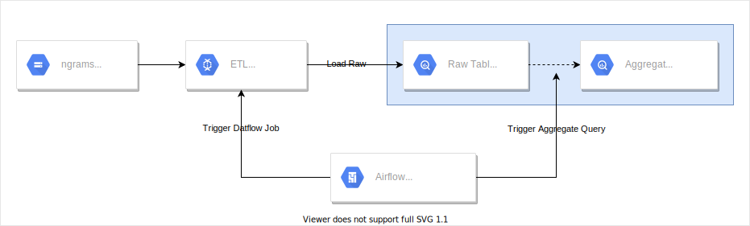

# Google Books Ngrams ETL Airflow

Airflow DAGs for exporting and loading the ngrams data to Google BigQuery:

- [load_ngram_dag.py](dags/load_ngram_dag.py) - loads google books ngrams from GCS buckets to BigQuery.

## Architecture



## Prerequisites

* linux/macos terminal 
* git
* [gcloud](https://cloud.google.com/sdk/install)

## Setting Up

1. Create a Google Cloud Composer environment:

    ```bash
    PROJECT=$(gcloud config get-value project 2> /dev/null)
    ENVIRONMENT_INDEX=0
    ENVIRONMENT_NAME=${PROJECT}-${ENVIRONMENT_INDEX} && echo "Environment name is ${ENVIRONMENT_NAME}"
    gcloud composer environments create ${ENVIRONMENT_NAME} --location=us-central1 --zone=us-central1-a \
        --disk-size=30GB --machine-type=n1-standard-1 --node-count=3 --python-version=3 --image-version=composer-1.17.0-preview.5-airflow-2.0.1 \
        --network=default --subnetwork=default    
    ```
   
    Note that if Composer API is not enabled the command above will auto prompt to enable it.

2. Follow the steps in [Configuring Airflow Variables](#configuring-airflow-variables) to configure Airflow variables.
    
3. Follow the steps in [Deploying Airflow DAGs](#deploying-airflow-dags) 
to deploy Airflow DAGs to Cloud Composer Environment.
 
4. Follow the steps [here](https://cloud.google.com/composer/docs/how-to/managing/creating#notification) 
to configure email notifications.
   
## Configuring Airflow Variables

- Clone word etl Airflow: `git clone https://github.com/gcp-pdp/google-books-ngrams && cd google-books-ngrams/airflow`.
- Copy `example_airflow_variables.json` to `airflow_variables.json`. 
  Edit `airflow_variables.json` and update configuration options with your values. 
  You can find variables description in the table below. For the `output_bucket` variable 
  specify the bucket created on step 1 above. You can get it by running `echo $BUCKET`.
- Open Airflow UI. You can get its URL from `airflowUri` configuration option: 
  `gcloud composer environments describe ${ENVIRONMENT_NAME} --location us-central1`.
- Navigate to **Admin > Variables** in the Airflow UI, click **Choose File**, select `airflow_variables.json`, 
  and click **Import Variables**.
  
### Airflow Variables

| Variable | Description |
|---|---|
| `input_datasets` | Comma-separated list of ngrams datasets, default: `eng` |
| `input_file` | Gcs path to ngrams files, default: `gs://books/ngrams/books/20200217/{dataset}/{n}-*.gz` |
| `output_table` | BigQuery table to write output to, default: `{dataset}_{n}` |
| `dataset_project_id` | The project id where destination BigQuery dataset is |
| `dataset_name` | The destination BigQuery dataset name |
| `dataflow_template_path` | Gcs path prefix to Dataflow flex template |
| `dataflow_environment` | The runtime environment for the FlexTemplate job. [Reference](https://cloud.google.com/dataflow/docs/reference/rest/v1b3/projects.locations.flexTemplates/launch#FlexTemplateRuntimeEnvironment) |
| `notification_emails` | Comma-separated list of emails where notifications on DAG failures, retries and successes will be delivered. |
| `load_max_active_runs` | Max active DAG runs for export, default: `1` |
  
## Deploying Airflow DAGs

- Get the value from `dagGcsPrefix` configuration option from the output of:
  `gcloud composer environments describe ${ENVIRONMENT_NAME} --location us-central1`.
- Upload DAGs to the bucket. Make sure to replace `<dag_gcs_prefix>` with the value from the previous step:
  `./upload_dags.sh <dag_gcs_prefix>`.
- To understand more about how the Airflow DAGs are structured 
  read [this article](https://cloud.google.com/blog/products/data-analytics/ethereum-bigquery-how-we-built-dataset).
- Note that it will take one or more days for `export_dag` to finish exporting the historical data.

## Troubleshooting

To troubleshoot issues with Airflow tasks use **View Log** button in the Airflow console for individual tasks.
Read [Airflow UI overview](https://airflow.apache.org/docs/stable/ui.html) and 
[Troubleshooting DAGs](https://cloud.google.com/composer/docs/how-to/using/troubleshooting-dags) for more info. 